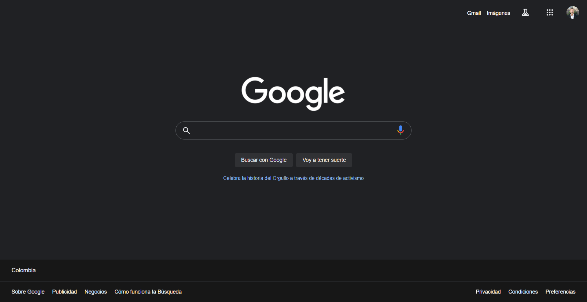

# Frontend Project - google search engine clone

Google clone layout exercise

## Table of contents

- [Overview](#overview)
  - [Screenshot](#screenshot)
  - [Links](#links)
- [My process](#my-process)
  - [Built with](#built-with)
- [Author](#author)

## Overview

In this project I reaffirmed the best practices in the development of a professional project, good accessibility, use of light resources, adaptability of elements and use of styles according to a real web design.

### Screenshot

### Links

- Solution URL: [click here](https://github.com/ronitzdev/google-clone)
- Live Site URL: [click here](https://google-clone-ronitzdev.netlify.app/)

## My process

### Built with

- Semantic HTML5 markup
- Flexbox
- Desktop to tablet workflow
- Media queries

## Author

- GitHub - [ronitzdev](https://github.com/ronitzdev)
- Frontend Mentor - [@ronitzdev](https://www.frontendmentor.io/profile/ronitzdev)
- LinkedIn - [@ronitzdev](https://www.linkedin.com/in/ronitzdev/)